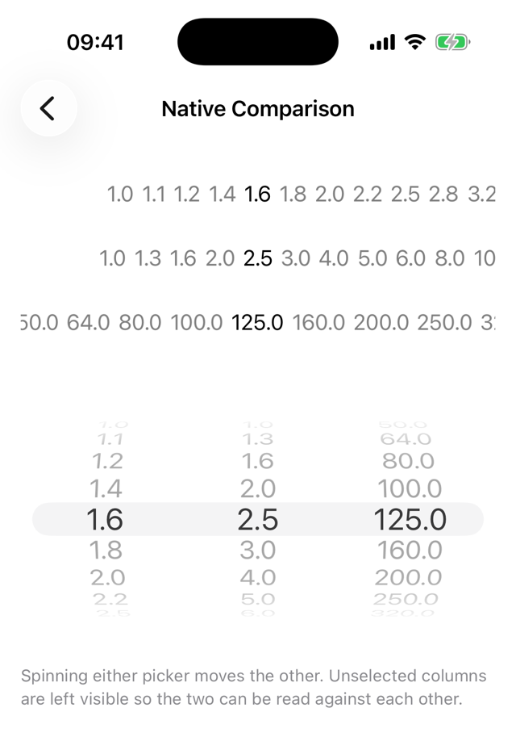
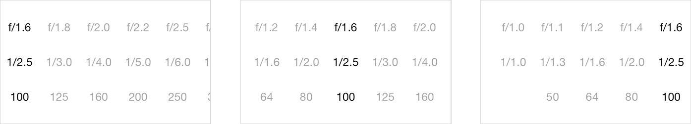

# HorizontalPicker

`LAUPickerView` is a horizontal *spinning-wheel* picker view for iOS.

It is the same idea as `UIPickerView`, but the wheel runs left to right: a
component is a row of **columns** instead of a column of rows. It follows
`UIPickerView`'s data source and delegate semantics, so if you have written one
you have written the other.



## Requirements

* iOS 13.0 or later
* iPhone and iPad
* Swift 5.5 or later

## Installation

### Swift Package Manager

Add the package to your `Package.swift`:

```swift
dependencies: [
    .package(url: "https://github.com/laugga/HorizontalPicker.git", from: "1.0.0")
]
```

Or in Xcode, *File > Add Package Dependencies…* and enter the repository URL.

Then import it:

```swift
import HorizontalPicker
```

## Usage

### 1. Add the picker

```swift
let pickerView = LAUPickerView(frame: view.bounds)
pickerView.dataSource = self // LAUPickerViewDataSource
pickerView.delegate = self   // LAUPickerViewDelegate
view.addSubview(pickerView)
```

`LAUPickerViewDataSource` and `LAUPickerViewDelegate` are plain Swift
protocols. The adopting type does not have to be an `NSObject` subclass.

### 2. Implement the data source

Both methods are required.

```swift
func numberOfComponents(in pickerView: LAUPickerView) -> Int {
    // the number of components (rows of columns) to show
}

func pickerView(_ pickerView: LAUPickerView, numberOfColumnsInComponent component: Int) -> Int {
    // the number of columns in that component
}
```

### 3. Implement the delegate

Every delegate method has a default implementation, so write only the ones you
need.

```swift
func pickerView(_ pickerView: LAUPickerView, titleForColumn column: Int, forComponent component: Int) -> String? {
    // the title for a column-component pair, or nil to leave the column blank
}

func pickerView(_ pickerView: LAUPickerView, didChangeColumn column: Int, inComponent component: Int) {
    // a new, different column has been selected
}
```

The rest of the delegate:

| Method | What it does | Default |
|---|---|---|
| `pickerView(_:viewForColumn:forComponent:reusingView:)` | Supply your own column view instead of a title | `nil` — the picker draws the title |
| `pickerView(_:heightForComponent:)` | The height of a component | An equal share of the picker's height |
| `pickerView(_:topSpaceForComponent:)` | Where a component sits vertically | Components stacked top to bottom |
| `pickerView(_:accessibilityIdentifierForComponent:)` | The component's accessibility identifier | `nil` |
| `pickerView(_:didTouchUpColumn:inComponent:)` | A touch ended on the selected column | Nothing |
| `pickerView(_:didTouchUp:inComponent:)` | A touch ended anywhere else in a component | Nothing |

### 4. Drive it

The columns do not have to exist when the picker is created. Call
`reloadData()` once the data source has them and the picker rebuilds itself.

```swift
pickerView.reloadData()

pickerView.selectColumn(3, inComponent: 0, animated: true)
let column = pickerView.selectedColumn(inComponent: 0)

pickerView.showComponent(1, andHideComponent: 0, animated: true)
```

### 5. Configure it

```swift
pickerView.selectionAlignment = .left   // .left, .center (the default) or .right
pickerView.setSelectionAlignment(.right, animated: true)

pickerView.hidesUnselectedColumns = false // keep unselected columns fully drawn
pickerView.soundsEnabled = false          // silence the click-input sound
pickerView.hapticsEnabled = false         // silence the selection haptic
```

`selectionAlignment` moves the selection indicator — and so the resting
position of the selected column — to the left, the centre or the right:



## Example app

`Example/` is a catalog app: thirteen scenarios in six sections — Basics,
Layout, Data, Interaction, Customization and Regressions — each opening a
working screen built through the public API alone. Open
`Example/HorizontalPicker.xcodeproj` and run the *Example* scheme.

The *Native Comparison* scenario, shown above, puts `LAUPickerView` and
`UIPickerView` over the same values with the selection linked in both
directions: spinning a column of the horizontal picker moves the matching row
of the native one, and spinning a row of the native one moves the column back.

The example consumes the package from the repository root as a *local* Swift
package, so it always builds the sources in the working tree.

## Building and testing

The package is UIKit-only, so it is built against an iOS simulator rather than
with `swift build`:

```sh
xcodebuild -scheme HorizontalPicker -destination 'generic/platform=iOS Simulator' build
xcodebuild test -scheme HorizontalPicker -destination 'platform=iOS Simulator,name=iPhone 17'
```

## License

MIT. See [LICENSE](LICENSE).
